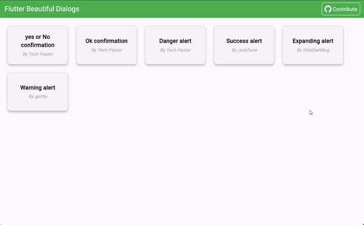

# Beautiful Dialogs - Flutter



Bienvenue sur **Beautiful Dialogs**, un projet open-source Flutter où les développeurs peuvent contribuer en ajoutant de magnifiques widgets de dialogues ! 🌟

Explorez une démo en direct des dialogues [ici](https://beautiful-dialogs.netlify.app/) pour voir la magie en action ! ✨

## Bien démarrer

Pour contribuer à ce projet, suivez ces étapes simples :

### 1. Forker le dépôt et n'oubliez pas d'ajouter une étoile ⭐

Rendez-vous sur le [dépôt](https://github.com/Docteur-Parfait/beautiful_dialog.git) et cliquez sur le bouton **Fork**. N’oubliez pas d'ajouter une étoile au projet comme signe d’appréciation !

### 2. Cloner le dépôt

Clonez votre dépôt forké en local :

```bash
git clone https://github.com/VOTRE_NOM_UTILISATEUR/beautiful_dialog.git
cd beautiful_dialog
```

### 3. Créer une nouvelle branche

Créez une nouvelle branche pour votre dialogue personnalisé :

```bash
git checkout -b votre-nom-branche
```

### 4. Ajouter votre dialogue personnalisé

Dans le dossier `lib > dialogs`, ajoutez un nouveau fichier `.dart` avec le nom de votre composant de dialogue, par exemple `ok_confirmation_alert.dart`. Après, il faut se rendre dans le fichier `libs > dialogs > dialogs.dart` pour ajouter un export de son fichier. Voici un exemple de composant :

```dart
import 'package:flutter/material.dart';

class OkConfirmationDialog {
  static void showOkConfirmationDialog(
    BuildContext context, {
    required String title,
    required String message,
  }) async {
    return showDialog<void>(
      context: context,
      builder: (BuildContext context) {
        return AlertDialog(
          title: Text(title),
          content: Text(message),
          actions: <Widget>[
            ElevatedButton(
              style: ElevatedButton.styleFrom(
                backgroundColor: Colors.blue, // Couleur bleue pour Ok
              ),
              child: const Text('Ok'),
              onPressed: () {
                Navigator.of(context).pop(); // Fermer la boîte
              },
            ),
          ],
        );
      },
    );
  }
}
```

### 5. Appeler votre dialogue

Dans `lib/views/dialog_view.dart`, utilisez le widget `CustomButton` pour appeler votre dialogue comme ceci :

```dart
CustomButton(
  text: "Confirmation Ok",
  author: "Nom du Contributeur",
  onTap: () => OkConfirmationDialog.showOkConfirmationDialog(
      context,
      title: "Confirmation",
      message: "Voulez-vous vraiment continuer ?"),
)
```

### 6. Commit, push et soumettre une Pull Request

Une fois que vous avez ajouté votre dialogue, commitez vos modifications :

```bash
git add .
git commit -m "Ajout d'un nouveau dialogue personnalisé"
git push origin votre-nom-branche
```

Ensuite, ouvrez une Pull Request depuis votre dépôt forké.

## Règles de contribution

- Les contributions doivent concerner l'ajout de nouveaux dialogues.
- Assurez-vous que la structure et le format du code sont respectés.
- Testez votre dialogue avant de soumettre une PR.
- Les contributeurs peuvent également travailler sur le site, comme ajuster les boutons, corriger les fautes ou ajouter des innovations. Cependant, la base reste de fournir une collection de "beautiful dialogs".
- Vous pouvez ajouter également un package externe mais pas plus que un

## Licence

Ce projet est sous licence MIT - consultez le fichier [LICENSE](LICENSE) pour plus de détails.

---

Bon codage et merci de contribuer à **Beautiful Dialogs** ! 😄
